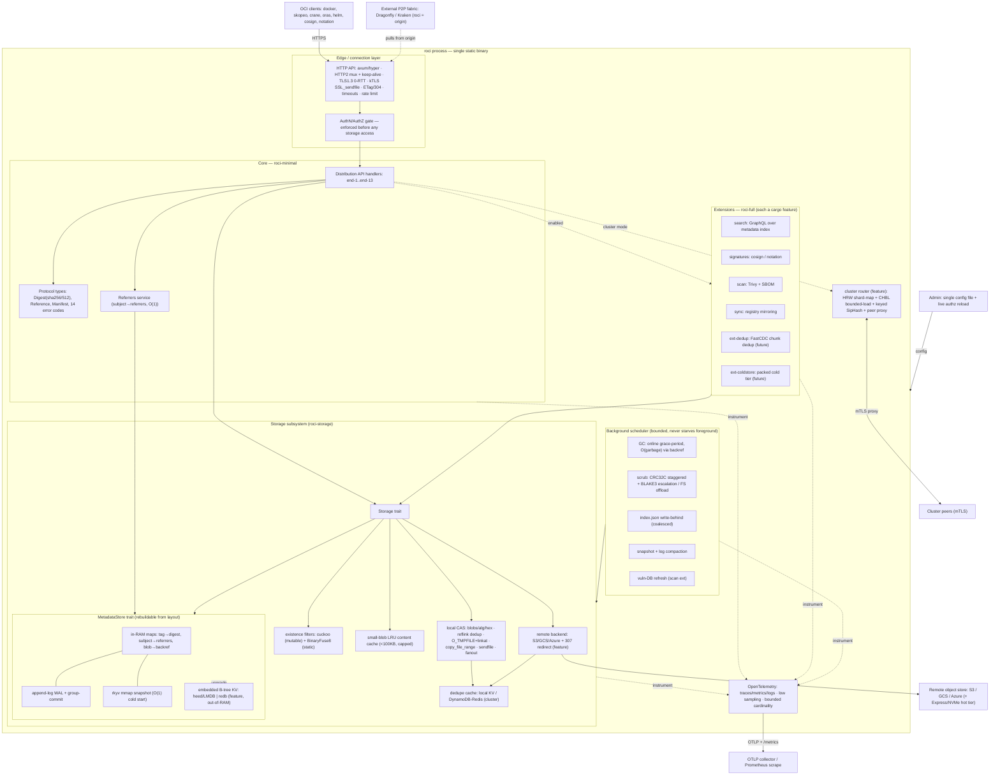

# roci — Architecture Design

Design document for **roci**, a Rust OCI Distribution registry. This document defines the internal architecture: component decomposition, data flow, the storage subsystem, and the extension model.

## Design lineage

roci's architecture is a deliberate reverse-engineering and re-implementation of [zot](https://zotregistry.dev)'s proven design, adapted to Rust and to roci's footprint/performance goals. Design sources (zot docs, v2.1.21):

- [zot — Architecture](https://zotregistry.dev/v2.1.21/general/architecture) — overall component model, minimal-vs-full split, background tasks, config sectioning.
- [zot — Storage Planning](https://zotregistry.dev/v2.1.21/articles/storage/) — storage model, dedupe, inline GC, scrub, local/remote backends, subpaths.
- [zot — Security Posture](https://zotregistry.dev/v2.1.21/articles/security-posture/) — informs [`SECURITY.md`](SECURITY.md); referenced there.
- [zot — Scale-out clustering](https://zotregistry.dev/v2.1.21/articles/scaleout/) — horizontal scale-out model (shard-per-repo, request proxying, compute-only vs. compute+storage).

Spec sources (local): [`spec/distribution-spec/spec.md`](spec/distribution-spec/spec.md), [`spec/image-spec/spec.md`](spec/image-spec/spec.md), [`spec/image-spec/image-layout.md`](spec/image-spec/image-layout.md), [`spec/docker-registry-api-v2.md`](spec/docker-registry-api-v2.md).

**Evidence basis.** The concrete engineering choices below (index engine, existence filter, GC discipline, sharding hash, lazy-pull stance) are grounded in the systems literature and production evidence collected in [`RESEARCH.md`](RESEARCH.md); citations use its source keys, e.g. (RESEARCH: Venti), (RESEARCH: CHBL).

Where roci diverges from zot, it is called out explicitly as **[roci divergence]**.

## Design goals (adopted from zot)

1. **OCI-first.** HTTP APIs strictly conform to the OCI Distribution Spec. On-disk layout is strictly OCI Image Layout. No vendor-specific protocols (no Docker schema1, no proprietary APIs). Consequence: any OCI image layout directory can be served directly, and any dist-spec-compliant client interoperates.
2. **Single binary.** All features in one static binary; behavior governed by one config file. Deployable on bare-metal, cloud, Kubernetes, and embedded/IoT.
3. **Enable only what you need.** Hard separation between the OCI-compliant core and add-on **extensions**, selectable at build-time (cargo features) and run-time (config). Minimizes dependency surface and binary size.
4. **[roci divergence] Footprint & speed as first-class invariants.** Streaming I/O end-to-end, zero-copy blob serving, **RSS bounded to metadata (never stored bytes) with an explicit per-structure budget** (see §RAM consumption & memory scaling), fast cold start. Rust's no-GC memory model + a low-fragmentation allocator make footprint a measured, enforced property (see [`PLAN.md`](PLAN.md) cross-cutting benchmarks).

## Build flavors

Mirrors zot's `minimal` / `full` split, implemented with cargo features:

```
roci-full = roci-minimal + extensions
```

- **`roci-minimal`** — core OCI-compliant registry only (Distribution Spec). Smallest attack surface and binary. The baseline release.
- **`roci-full`** — minimal + all extensions (search, signatures, scanning, sync, metrics UI, …).
- **Custom** — any subset, e.g. `cargo build --features search` yields minimal + search only. The build system exposes each extension as an independent feature so operators tune the minimal↔full spectrum.

Extensions map to the OCI [distribution-spec extensions](https://github.com/opencontainers/distribution-spec/tree/main/extensions) model — features not in the Distribution Spec but permitted as extensions.

## Component model (target buildout)



**Read the model as four planes:** an **edge plane** (HTTP/2 + TLS + authn gate) fronts a **core plane** (dist-spec handlers + protocol types + referrers) that talks only to the **storage plane** via two traits (`Storage`, `MetadataStore`); a **background plane** (scheduler) owns all periodic work off the request path. Extensions, the cluster router, and remote/object backends are additive, feature-gated satellites — remove them all and the edge+core+storage+background planes are a complete, conformant single-node registry. Telemetry is orthogonal, instrumenting every plane into one provider.

### Layers

- **HTTP API layer.** Async server (axum/hyper), **HTTP/2 multiplexing + keep-alive** with HTTP/1.1 fallback, TLS 1.3 (0-RTT resumption) with optional kTLS. Terminates TLS, parses/validates requests, applies read/write timeouts and rate limits, honors conditional requests (`ETag`/`If-None-Match` → `304`), routes to handlers. Every request is an OpenTelemetry span. Roundtrip-efficiency design in §HTTP roundtrip efficiency.
- **Core (`roci-minimal`).** Distribution API handlers (all `end-1`..`end-13` endpoints), protocol types (`Digest`, `RepositoryName`, `Reference`, manifest models, the 14-code error enum), and the AuthN/AuthZ gate. **The core has zero dependency on any extension.** This is the seam that makes minimal builds real.
- **AuthN/AuthZ gate.** Enforced *before* any storage access — mirrors zot: "controls are enforced before access is allowed into the storage layer." Detailed in [`SECURITY.md`](SECURITY.md).
- **Extensions (`roci-full`).** Each is an independent crate behind a cargo feature, consuming stable core + storage traits. An extension can never be on the critical path of core conformance; disabling all extensions must leave a fully conformant registry.
- **Storage subsystem.** Two traits: **`Storage`** (blob CAS: reflink dedup, `O_TMPFILE`+linkat staging, `copy_file_range` mount, `sendfile`, fanout; local FS or remote object backend + dedupe cache) and **`MetadataStore`** (default append-log + in-RAM maps + WAL group-commit + rkyv snapshot; optional embedded B-tree KV), fronted by existence filters and a small-blob content cache. Detailed below.
- **Task scheduler.** Runs periodic background work — GC, sync mirroring, scrub, vuln-DB refresh — without degrading or interrupting foreground HTTP request handling (zot design). Bounded concurrency; foreground requests take priority.
- **OpenTelemetry.** Cross-cutting; every layer instruments spans + metric instruments into one provider (see [`PLAN.md`](PLAN.md)). **[refined from RESEARCH]** kept near-free by design: **low default trace sampling** (Dapper's lesson — aggressive sampling makes tracing overhead negligible while retaining signal) and **bounded metric label cardinality** (no per-digest/per-repo labels on high-frequency instruments — cardinality is the real footprint trap). Target < ~2% overhead at default sampling, backed by tracing-overhead studies (RESEARCH: Dapper, Canopy, TracingOH, OTelCard).

### External interaction (from zot)

Two interaction types:

1. **Client data / meta-data queries** — all over HTTP. Core data-path (pull/push/discovery/management) governed strictly by the Distribution Spec. Meta-data queries depend on the `search` extension:
   - **`search` enabled** → GraphQL over a maintained index. **[refined from RESEARCH]** the index uses the same embedded B-tree KV as the core metadata (not an LSM/RocksDB, not an external DB) — read-heavy query workload, footprint budget (RESEARCH: RUM); zot's own search backend is bbolt, confirming the class.
   - **`search` disabled** → basic queries answered from the core APIs. **[roci divergence]** the fallback hits the lightweight in-memory tag/referrer indexes + existence filters rather than raw directory scans where feasible (RESEARCH: DataDomain).
2. **Admin configuration** — a single config file governs the instance.

## Configuration model (from zot)

A single configuration file governs the instance, divided into sections:

- `http` — listen address/port, TLS, read/write timeouts, rate limits.
- `storage` — root directory, dedupe, gc, commit, subpaths, storage driver, cache driver (see storage section).
- `log` — level, format, OTLP export.
- `extensions` — per-extension enablement and settings (`search`, `signatures`, `scan`, `sync`, `metrics`).

**Sensitive-credential exception (from zot):** config items containing secrets (S3 keys, LDAP bind password, token signing keys) MAY be stored in separate referenced files, allowing stricter filesystem permissions and native Kubernetes Secret mounting. Only authorization config is live-reloadable while running (see [`PLAN.md`](PLAN.md) Phase 6); other changes require restart.

**[roci divergence]** config format is a roci decision (likely TOML/YAML with a documented schema and load-time validation), whereas zot uses JSON. Zero-config defaults must yield a working local registry with no file at all.

## Storage subsystem

The heart of the design. Two invariants, straight from zot's storage model:

> **On the wire → OCI Distribution Spec. On the disk → OCI Image Layout.**

Consequences:
- Any dist-spec client can read/write roci.
- Storage *is* an OCI Image Layout — inspectable and portable with standard tooling.
- roci can **host any pre-existing OCI image layout** directory as a registry, even one built elsewhere (independent build → store → transfer → serve later).
- **Content addressing earns four properties for free** (RESEARCH: Venti): immutable/write-once blobs, idempotent coalescing writes (dedup by construction), integrity verifiable on every read, and safe caching/mirroring (a content-addressed blob is never stale — matters for scale-out proxying). **[refined from RESEARCH §8.1] Default new-blob/manifest digests to `sha512`, not `sha256`** — OCI permits both, and SHA-512 is **36–50% faster per byte on 64-bit hardware without SHA-NI** (which roci cannot assume across VMs/containers/ARM SBCs); both accepted on push, actual algo echoed in `Docker-Content-Digest`. **[roci divergence] BLAKE3 is used for internal-only paths** (scrub re-hashing 3–8× faster; a **Bao verified-streaming tree** stored as an OCI referrer lets clients verify an individual `Range` chunk without fetching the whole blob) — never as a wire digest, which stays sha256/sha512 (RESEARCH §8.1: BLAKE3-spec, SHA512-256, Blazehash-M4).
- **[roci divergence] "OCI Image Layout" means descriptors + CAS of *any* blob content, not tar-only layers.** Foreign media types (Nydus native RAFS blobs, eStargz/SOCI seekable layers, Helm charts, SBOMs, signatures) are storable and servable as blobs referenced by conformant manifests (RESEARCH: Nydus, SOCI; zot already serves Nydus). This is what makes roci a viable *origin* for the lazy-pull and artifact ecosystems.
- **[roci divergence]** roci implements no vendor protocol (same stance as zot: no Docker-specific protocol), but does vendor the Docker Registry V2 doc for the de-facto bearer-token *auth* flow only.

### Storage trait & backends

`Storage` is the abstraction all backends implement:

- **Local filesystem backend.** One or more root directories; content-addressable `blobs/<alg>/<hex>` store + `index.json`. Blob path is a pure function of digest → O(1) open. NFS/fuse mounts count as local. **[refined from RESEARCH §8.7]** the flat CAS is kept (correct for random-`open()`-by-digest; EXT4/XFS HTree handle tens of millions of files with stable reads); a **git-style 2-level fanout (`ab/cdef…`) is engaged above ~100K blobs per algorithm dir** to keep subdirectories dcache/readdir-friendly (one extra warm dentry lookup, negligible). Venti-arena/packfile single-file stores are **rejected** (optimize sequential at the cost of O(1) random access). `tar+zstd` layers (OCI v1.1) are **accepted and served natively**; no recompression at rest (recompression would change the digest — an OCI-contract violation).
- **Remote backend** (extension-gated by cost, not correctness). S3, GCS, Azure Blob — modeled after zot's `storageDriver`. **[refined from RESEARCH §8.8]** signed-URL **HTTP 307 redirect** for blob pulls only **above a `redirect_min_size` (~1 MB)** — below it, proxy (a redirect costs up to 50% throughput for <100 KB objects, ≈0% for >1 MB; manifests never redirected); server-side copies (mount, sync) use **parallel S3 multipart** (4–8× serial). S3 Express One Zone / local-NVMe LRU are optional **hot-tiers** (single-AZ → not the primary durable store) (RESEARCH: AlluxioRedirect, S3ECRBench).
- **Dedupe cache.** A digest→location index enabling cross-repo dedupe. Local KV for the FS backend; a remote table (DynamoDB/Redis-style) for cloud/cluster backends. Modeled after zot's `cacheDriver`.

Multiple storage paths (zot `subpaths`) route different repo prefixes to different backends/settings, presented as one registry over the HTTP API.

### Metadata index engine [refined from RESEARCH]

Derived, always-rebuildable-from-the-layout state (tag→digest, subject→referrers, blob→backref, blob-presence) lives behind a `MetadataStore` trait. **The `roci-minimal` default backend is a dependency-free append-only log + in-RAM maps** (detailed in the next subsection); an **embedded B-tree KV is a feature-gated upgrade** for out-of-RAM metadata or a shared cluster store. Never an external database in the baseline (single-binary invariant). The engine analysis below governs *that upgrade* backend.

- **Upgrade-backend engine choice: a single-file, embedded, B-tree-family KV with no background compaction threads.** When metadata outgrows RAM (very large multi-tenant deployments) or a shared store is needed, the trait is backed by a B-tree KV. roci's index workload is **read-heavy, modest-write**; the **RUM conjecture** (RESEARCH: RUM) → **LSM (RocksDB/sled/fjall) is the wrong fit** (2–5× worse reads, compaction threads fight the footprint budget). **[refined from RESEARCH §8.6]** **heed (LMDB)** is the stronger option where libc/C-FFI is acceptable — mmap single-level-store gives **1.8–3.0× faster random reads (3× at 16 threads) and 35% smaller on-disk** than redb (RESEARCH §8.6: redb-bench, LMDB-bench); **redb** (pure-Rust, no C) suits `no_std`/musl builds. Settled by the **Phase-1 benchmark deliverable**. Corroboration the *class* is right: zot's metadata backend is bbolt, a single-file B-tree.
- **Existence filter: an in-memory approximate-membership filter in front of the index** for the hot "is this blob/manifest present?" path (blob `HEAD`, push dedup skip, cross-repo mount, GC marking) — the Data Domain lever, removing ~99% of index/disk touches (RESEARCH: DataDomain, Foundation). **[refined from RESEARCH §8.5]** static per-snapshot referrer sets use a **binary-fuse-8 filter** (`xorf` crate — 9.0 bits/key, ~55 ns lookup, 2× faster build, strictly dominates ribbon/xor; RESEARCH: BinaryFuse); the **mutable** blob-presence set uses a **cuckoo filter** (only production-Rust deletable filter; deletes needed for GC), with the **Morton filter** (1.3–2.5× faster lookups, 3–15× faster inserts at high load; RESEARCH: Morton) tracked as a `roci-filter` upgrade once a Rust impl exists. Single-digit MB RAM; a miss falls through to the authoritative index.
- **Rebuildability (RESEARCH: Venti — index separate from the write-once log, regenerable):** the layout/CAS is the source of truth; the index and filters are caches reconstructable by a bounded streaming walk. This is what makes zot-style `fastRestart` sound — a stamp mismatch just triggers a rebuild, never data loss.

### Hyper-optimized OCI-layout ↔ index interaction, minimal dependencies [design]

**The tension.** The OCI Image Layout mandates three things on disk: `oci-layout` (marker), `blobs/<alg>/<hex>` (CAS), and a single flat **`index.json`** (an image index holding *every* ref/tag as a descriptor with an `org.opencontainers.image.ref.name` annotation). CAS is already perfect — a blob GET is one `open()` by digest, zero dependencies, O(1). The problem is `index.json`: a naïve registry treats it as the live tag store and **rewrites the whole file on every tag push/delete** — O(refs) I/O and a global write-lock over all tags per operation. That is a hard scaling wall (zot avoids it by bolting bbolt on top; still an external, CGo-adjacent dep). The design goal: keep the layout **spec-exact and portable** while making tag/referrer/existence operations O(1) and dependency-light.

**Principle — separate the roles the layout is being asked to play.** `index.json` is being overloaded as both (a) the durable interop/export artifact and (b) the hot mutable tag index. Split them:

1. **The layout is the durable source of truth and interop surface.** `blobs/` (CAS) + `oci-layout` + a spec-valid `index.json` are always maintained so that any OCI tool (skopeo, `oras`, another registry, `find`) can read the directory directly. This is non-negotiable (invariant 6).
2. **The hot index is a derived, in-memory structure** that answers every request path (tag→digest, subject→referrers, blob-presence, blob→backref) from RAM, and is **rebuildable from the layout** at any time. It is a cache, never the truth (invariant 8).
3. **Durability of the hot index between restarts uses a small append-only log roci owns** — not necessarily an external KV.

**The low-dependency mechanism — own the write path, borrow nothing for correctness.**

- **Blob path: no KV at all.** `blobs/<alg>/<hex>` is a pure function of the digest. GET/HEAD/existence-on-disk need only `stat`/`open`. The cuckoo/BinaryFuse existence *filter* (single-digit MB, in-process, from `xorf`/`cuckoofilter`) answers "present?" without even a syscall on the hot path; a miss falls through to `stat`. Zero storage engine involved in the dominant operation.
- **Small-blob content cache [refined from RESEARCH §9.2].** Manifests/configs (1–50 KB) dominate request *count* (every pull reads them) but a trivial fraction of bytes. A bounded in-RAM `digest→bytes` **LRU cache** for blobs below `small_blob_threshold` (default 100 KB — the DB-vs-file crossover found independently by SQLite and Gray et al.) serves them with **zero `open()`/`close()` syscall** → **35–80% latency cut** on the dominant request type (RESEARCH: SQLiteFasterFS, SQLiteInternBlob). The loose file still exists (OCI-conformant); the cache is a pure hot-path accelerator, miss → loose file. Large layer blobs are never cached — they go straight to `sendfile` (AIStore: +3× throughput, caching them would only pollute RAM; RESEARCH: AIStoreSendfile).
- **Metadata (tags, referrers, backref): an append-only intent log + in-memory maps.** Every mutating op (tag set/delete, manifest put/delete) appends one CRC32C-framed record (`{op, repo, key, digest, gen}`) to `roci-meta.log` — an `O(1)` append, never an O(refs) rewrite. Query state is **in-memory maps** (tags `HashMap`/`BTreeMap`; subject→referrers and blob→backref multimaps) rebuilt by replaying the log at startup — the Venti lesson (index separate from a regenerable log) applied to metadata, needing **no external KV**. **[refined from RESEARCH §9.3] WAL group-commit:** under a push storm the log uses leader-coalesced `fdatasync` (one fsync drains all queued appends, PostgreSQL/RocksDB pattern) → **10–250× fewer fsyncs, 5–10× throughput on NVMe / 20–100× on HDD**, ~150 LoC, zero new deps (`std` `Mutex`/`Condvar`). io_uring batched `fdatasync` is the same win by another route (+14–18%) and is the one place io_uring helps the local store (RESEARCH: Jasny-PVLDB26).
- **`index.json` is regenerated lazily/coalesced, not per-op.** After a tag mutation the in-memory tag map is authoritative immediately (the client's next pull sees it); the spec-visible `index.json` is rewritten by a **debounced, coalescing background task** (write-behind: many rapid tag ops collapse into one atomic `O_TMPFILE`+`linkat` replacement of `index.json`). Readers that go through roci never wait on it; external tools reading the directory see an eventually-current, always-*valid* index. This turns the O(refs)-per-op wall into O(refs) amortized across a batch.
- **Log compaction is trivial and safe.** When `roci-meta.log` exceeds a threshold, a background pass writes a fresh log = the current in-memory state (one record per live key) via `O_TMPFILE`+`linkat`, then drops the old log. A crash mid-compaction leaves the old log intact (atomic swap). Generation counters (`gen`) make replay idempotent and give the GC grace-period/epoch semantics for free.
- **O(1) cold start via rkyv mmap snapshot [refined from RESEARCH §9.4].** Log replay is negligible at ≤1M records (~20–40 ms NVMe) but grows to 300–500 ms at 10M / 15–20 s on HDD. A periodic **rkyv zero-copy snapshot** of the maps (written atomically via `O_TMPFILE`+`linkat`; replay only the post-snapshot log tail) makes cold start **O(1) — `mmap` + demand-paging, <5 ms regardless of size** — and cuts index RSS ~10× (demand-paged pages vs a heap map). rkyv access is a 1.09 ns pointer cast, no deserialize loop (RESEARCH: rkyv-bench, LMDB-SDC). Crates `rkyv` + `memmap2` (pure-Rust, no C). Enabled for large/HDD/embedded deployments; the `fastRestart` stamp doubles as the snapshot-fresh check. Never the *mutable* live format (the WAL is the source of durability) — snapshot is read-only, rebuilt from the maps.

**Where an embedded KV still earns its place — and how it stays optional.** The append-log + in-RAM maps model is ideal for the local-minimal single node: **zero external storage dependency, everything rebuildable from the layout.** It holds while the live metadata set fits in RAM. **[measured, RESEARCH §9.6 first-party benchmark]** budget it from data: repo-qualified `(repo,tag)→digest` entries cost **~273 B/ref** (higher than the earlier ~130 B/ref estimate) → **~298 MB RSS at 1M refs, 1.38 GB at 5M, 2.76 GB at 10M**; heap-budget crossovers land at **~1.8M refs (0.5 GB), ~3.7M (1 GB), ~7.3M (2 GB)**. **Adopted: in-RAM maps are the backend up to ~2–4M references (≈0.5–1 GB heap)** — below that they are both smaller *and* 3–6.5× faster on lookups than a KV, so map-to-disk would be a *latency regression*. The rkyv-mmap snapshot above is the first RSS lever at that band for memory-constrained nodes. Only at **≥~10M refs, a hard RAM cap, or a shared-cluster store** does the embedded B-tree KV (redb pure-Rust, or heed/LMDB — RESEARCH §8.6) earn its place — its footprint becomes evictable page cache (~430 B/ref on disk) instead of unbounded heap, at the cost of the measured 3–6.5× read hit. The trait is the seam: `roci-minimal` ships the dependency-free append-log backend; the KV backend is a feature-gated upgrade, not a baseline requirement. Either way the layout stays the source of truth and the log/KV/snapshot are rebuildable caches.

**Net properties.** Blob path: dependency-free, O(1), zero-copy. Tag/referrer path: O(1) append + in-RAM lookup, no per-op `index.json` rewrite, no mandatory external KV. Cold start: replay a small sequential log (or `fastRestart` stamp skip; else a bounded streaming walk of the layout rebuilds everything). Interop: the directory is always a spec-valid OCI layout any tool can consume. Dependencies for the minimal core: `std` + our framed log + a small in-process filter crate — no database engine, no CGo, no daemon.

### Inline storage optimizations (from zot)

All designed to run **online** — never require taking the registry offline:

- **Deduplication [refined from RESEARCH §8.2].** Single physical copy of identical content across manifests. **Primary mechanism = reflink / CoW clone (`ioctl FICLONE`), not hard-link** — reflinks give identical O(1) space-sharing but with **independent deletion and no write-through-shared-inode hazard** (hard-links couple deletion into a smuggled refcount problem and risk mutating every repo sharing an inode). Supported on btrfs/XFS/APFS/ReFS; roci calls it directly via `rustix::fs::ioctl_ficlone` (no `unsafe`), **falling back to a hard link, then a streaming copy** on ext4/NFS/cross-device. CAS makes intra-path dedup free (same digest → same file); the dedup feature extends it *across* paths/repos. Sub-chunk dedup stays a **FUTURE `roci-ext-dedup`** (FastCDC — 10× faster than Rabin, `fastcdc` crate; RESEARCH §8.2).
  - **[implemented — Phase 2]** The cross-repo mount / cross-path dedup promotes in contract order: **reflink (`rustix::fs::ioctl_ficlone`, crash-atomic temp+rename)** → **`std::fs::hard_link`** (O(1) same-fs) → a **`tokio` streaming copy** (cross-device / no-hardlink; temp + `fsync` + rename), with the streaming copy the portable path. An existing destination is validated **beneath-root, no-follow** as a regular file before it is an idempotent success (never re-copied — blobs are content-addressed), and a same-repo (`src == dest`) mount short-circuits. The Linux-only branches are exercised at the CI-enforced **≥95% line-coverage floor** on a real-Linux run (`just coverage-linux`, `Containerfile.coverage`; uncovered lines are printed for triage). Safety: hard-links couple deletion (mitigated by the online backref-GC grace period, Phase 5) and share an inode across repos (safe because CAS blobs are immutable/write-once, never modified in place, and fds are never opened `O_RDWR` after promotion).
- **`hydrateBlobOnRead` semantics (zot v2.1.21 default = repo-local).** A blob read for a digest present only in the global dedupe cache (different repo) returns `404` by default, preserving repository boundaries and never mutating storage on a read. Cross-repo access requires an explicit blob mount (`end-11`) or upload. roci adopts this repo-local-by-default read semantic; `hydrateBlobOnRead=true` restores the older hard-link-on-read behavior.
- **Garbage collection — online, grace-period mark-sweep with an O(garbage) backref index [refined from RESEARCH §8.3].** GC roots = tags + manifests + referrers. dist-spec blob/manifest lifecycles are **not transactional**, so a sweep must never delete a blob mid-push or about-to-be-referenced — CNCF `distribution` goes **read-only/offline** for GC and Harbor has deleted in-flight blobs (RESEARCH: DistroGC, HarborGC). roci stays **online** and adds a live **backref multimap `blob_digest → {manifest_digests}`** in the same embedded B-tree as the referrers index, updated transactionally on each manifest put/delete: a blob is collectable the instant its backref set empties **and** its grace period (`gcDelay`, default 1h) elapses **and** it is not pinned by an in-flight upload → **incremental GC is O(garbage), not O(total)**. Data Domain's O(logical) GC was **20–100× slower at high dedup ratios** (RESEARCH: FAST17-GC); the classic refcount warning targets chunk-level global-dedup snapshots, which roci (2-level manifest→blob, single-writer-per-repo) does not have. Full mark-sweep remains the cold-start/rebuild backstop. Tunables mirror zot: `gc`, `gcDelay`, `gcInterval`, `gcTimeWindow`.
- **Scrub (extension) [refined from RESEARCH §8.4].** Not a periodic full SHA re-hash (worst strategy by the evidence). Instead: (1) store a fast **CRC32C** checksum at write (hardware CRC32C ~50 GB/s → **~12× faster scrub passes** than re-hashing SHA); (2) scrub with the fast checksum, **escalating to a full SHA/BLAKE3 re-hash only on mismatch**; (3) **staggered + adaptive** scheduling exploiting bit-rot locality (**order-of-magnitude better mean-latent-error-time at ~2% overhead** vs sequential; RESEARCH: Scrub-FAST10); (4) on **btrfs/ZFS, delegate to the filesystem scrub** and disable the app pass (RESEARCH: ZFS-integrity).
- **Commit.** Optional immediate flush-to-disk (`commit=true`) for RAM-constrained embedded devices (e.g. Raspberry Pi), trading throughput for durability. Off by default. **[refined from RESEARCH §8.8]** the commit path uses **`fdatasync`** (not `fsync`) — flushes data without the atime metadata update, saving ~30–50 µs/blob on NVMe.
- **[roci divergence] Fast restart.** zot's `fastRestart` skips the startup storage walk when a stamp matches binary+config identity. roci adopts this and pushes further: the startup walk is itself streaming and bounded so even a cold walk stays within the footprint budget.

### Referrers index

The subject→referrers reverse index (dist-spec `end-12a/b`) is maintained in the storage subsystem on every manifest put/delete, so `GET referrers` is an O(1) index read, not a repository scan. Falls back to the referrers-tag-schema (`<alg>-<ref>`) for compatibility. (See [`PLAN.md`](PLAN.md) Phase 3.)

**[refined from RESEARCH] The referrers index is load-bearing beyond signatures — it is the lazy-pull metadata backbone.** AWS SOCI stores its file→byte-range lazy-loading index *as an OCI referrer artifact*, and Nydus "zran" attaches a tiny `.meta` sidecar the same way (RESEARCH: SOCI, Nydus). So the same O(1) reverse index that serves signatures/SBOMs also makes lazy-pull metadata discovery cheap at hyperscale. This is why referrers is treated as core infrastructure, not a signature-only feature, and why it must stay O(1) under load.

## Background task scheduler (from zot)

A single scheduler owns all periodic work: GC sweeps, sync mirroring, scrub passes, vuln-DB refresh. Design rules:

- Bounded worker pool; foreground HTTP handling is never starved.
- Tasks are cancellation-aware and restart-safe.
- Each task is a distinct OTel span tree for observability.
- GC and scrub coordinate with the write path so an in-flight push is never corrupted.

## Scaling: vertical & horizontal

roci targets **both** scaling axes. Vertical scaling is the design's default posture; horizontal scale-out is the cluster model reverse-engineered from [zot — Scale-out clustering](https://zotregistry.dev/v2.1.21/articles/scaleout/).

### Vertical scale (scale-up) — the baseline

A single roci instance must exploit a bigger box efficiently before any clustering is needed. This is where roci's footprint/performance invariants pay off:

- Async runtime over a bounded worker pool sized to available cores; no thread-per-connection.
- Streaming, zero-copy blob I/O (`sendfile`/`mmap`) → throughput scales with disk/NIC, not CPU copies; the primitive lazy-pull clients (eStargz/SOCI) exercise via `Range` (RESEARCH: eStargz, SOCI, Slacker). **[refined from RESEARCH §8.8/§9.5] Under HTTPS, plain `sendfile` cannot be zero-copy** (TLS bounces through userspace) — roci uses **kTLS + `SSL_sendfile`** (opt-in `ktls`, OpenSSL ≥ 3.0 / Linux ≥ 5.2) to restore in-kernel zero-copy under TLS (**+13–28%**; RESEARCH: NginxKTLS), plus `posix_fadvise` hints (`SEQUENTIAL`+`DONTNEED` full-blob; `RANDOM`+`WILLNEED` ranges). **io_uring does NOT help the read path** — `IORING_OP_SPLICE` is **10–25% *slower* than sendfile** (Axboe/Netty #15747; no `IORING_OP_SENDFILE` exists) and `SEND_ZC` is mutually exclusive with kTLS; io_uring is adopted only on the **write path** (batched `fdatasync`, +14–18%). A full thread-per-core io_uring redesign (**compio**) is **FUTURE** — −46% P95 / +18% at high load but zero gain at light load and no production HTTP stack today (RESEARCH: NettyAxboe25, Jasny-PVLDB26, IggyTPC).
- O(1) content-addressed blob access; in-memory tag/referrer B-tree indexes fronted by an approximate-membership filter (§Metadata index engine) so existence checks stay off disk → query latency flat under load (RESEARCH: DataDomain).
- Bounded, back-pressured memory: every in-RAM structure has an explicit cap and RSS scales with *metadata*, never with stored bytes (see §RAM consumption below).
- **[roci divergence]** vertical headroom is a tracked benchmark (throughput, RSS, cold start) so scale-up efficiency never silently regresses (see [`PLAN.md`](PLAN.md)).

### RAM consumption & memory scaling [design]

**Governing principle: RSS scales with the number of *references* (tags/manifests/referrers), not with the number or size of stored *bytes*.** Blob content is never resident except transiently while streaming, and even that is zero-copy (kernel page cache, not the heap). This is what lets one instance serve a multi-TB corpus in tens–hundreds of MB of RSS, and it is the reason roci fits the same binary on a Raspberry Pi and a hyperscale node.

**Per-structure budget (steady state):**

| Structure | Grows with | Cost | Bound / mitigation |
|---|---|---|---|
| Blob content in RAM | — | **0** | Never buffered; `sendfile`/kTLS streams from page cache. Invariant 4 + 13. |
| Tag / referrer / backref maps | # references | ~130 B/entry heap (32 B key + 32 B digest + hashbrown overhead) → ~130 MB per 1M refs, ~1.3 GB per 10M (RESEARCH §9.4) | rkyv **mmap snapshot** demand-pages this ~10× smaller (only hot pages resident); or the KV backend offloads it entirely. |
| Existence filters (cuckoo + BinaryFuse8) | # blobs | ~9–12 bits/blob → single-digit MB per ~1M blobs (RESEARCH: BinaryFuse, Cuckoo) | Fixed, tiny; rebuildable. |
| Small-blob LRU content cache | capped | configurable (default 256 MB / 1% RAM) | Hard cap with LRU eviction; miss → loose file. |
| Upload sessions | # concurrent pushes | streaming staging buffer per session (≪ blob size) | Bounded by the concurrency limit + per-session buffer cap; never the whole blob (invariant 4). |
| Metadata write-ahead log | — | **0 steady RSS** (append-only file; group-commit batches in a small bounded queue) | Compacted when it exceeds a threshold. |
| OTel spans/metrics | request rate × sampling; label cardinality | bounded by sampling + cardinality caps (RESEARCH: Dapper, OTelCard) | Low default sampling; no per-digest/per-repo labels. |

**Three tiers of memory posture, one binary:**

1. **Constrained / embedded (Raspberry Pi, edge):** enable the **rkyv mmap snapshot** so the metadata index is demand-paged (RSS ≈ working set, not total refs) and cap the small-blob cache low (or off). Steady RSS for a small registry: tens of MB. `commit=true` for durability on flaky power. This is the "local minimal" target.
2. **Default single node:** in-RAM maps + bounded small-blob cache. RSS ≈ 130 MB/1M refs + cache cap + runtime. Predictable, tunable, and flat under request load (query cost is O(1), not O(corpus)).
3. **Very large / multi-tenant (out-of-RAM metadata):** switch the `MetadataStore` trait to the **embedded B-tree KV** (heed/LMDB mmap single-level-store → the OS page cache *is* the index, RSS = hot working set regardless of total size; RESEARCH §8.6, LMDB-SDC). Metadata then scales past RAM without the process heap growing.

**Why nothing grows unbounded:** the two structures that could grow with corpus size — the metadata maps and the existence filters — are both (a) rebuildable caches, (b) offloadable to mmap/KV so the OS pages them, and (c) capped in the constrained profile. Blob bytes, the only truly large data, are never on the heap. The allocator matters at this scale: roci pins a compacting-free, low-fragmentation allocator (jemalloc/mimalloc) so long-running RSS does not creep from fragmentation — a tracked benchmark (RSS over a 24 h push/pull soak), not a hope. Rust's no-GC model means no collector headroom or pause-driven RSS spikes.

### Horizontal scale (scale-out) — cluster model

For a large image corpus and/or high request rate, a **cluster** of roci instances shares the workload. Model from zot:

- **Shard per repository.** Each repo is owned by exactly one instance, which alone serves and writes that repo — preventing concurrent-writer corruption without distributed locking.
- **Shard-mapping function [refined from RESEARCH].** The receiving instance maps the repo path to its owning instance. zot uses a virtual-node **hash ring**; roci **[roci divergence]** defaults to **rendezvous / HRW hashing** for the small, static `members` list — for a handful of members HRW is simpler (no ring/vnode tuning), stateless, gives naturally minimal disruption on membership change, and is more locality-stable (RESEARCH: HRW, Karger97, Dynamo). A Maglev-style lookup table (RESEARCH: Maglev) is reserved for large dynamic membership (not in the current plan).
- **Bounded-load overload protection [refined from RESEARCH].** Plain consistent/rendezvous hashing balances no better than random — expected max load Θ(log n / log log n), so a few hot repos can overload one owner. roci layers **Consistent Hashing with Bounded Loads** (cap = ⌈c·m/n⌉, `c = 1+ε`, O(1/ε²) extra moves; deployed in Google LB/HAProxy/Envoy — RESEARCH: CHBL) — **but applied to read/proxy load only.** Writes stay pinned to the deterministic owner (single-writer invariant preserved); an overflowing *read* proxies to a replica/cache and never mutates. `ε` is configurable: small (locality-favoring) default for the storage-local topology, looser for the shared-S3 compute-only topology where locality matters less.
- **Proxy to owner.** If the owner is another instance, the receiver forwards the request and proxies the response back to the client; if the receiver is the owner, it handles locally. Any instance is a valid entry point. Production evidence that proxy-forwarding overhead is acceptable at hyperscale: Kraken proxies at ≥8k-host scale while sustaining >50% line rate (RESEARCH: Kraken).
- **Keyed hash is a security requirement, not just balance.** The shard key is an attacker-influenced **repo path**, so the hash MUST be **keyed (SipHash with a per-cluster `hashKey`)** to resist hash-flooding DoS that would collide many repos onto one instance (RESEARCH: SipHash). Never an unkeyed hash. (Tracked as a security invariant in [`SECURITY.md`](SECURITY.md).)
- **Cluster config** (`cluster` section): ordered `members` list (identical ordering on every instance, each owns one address), a shared `hashKey`, and mutual-TLS between peers for authenticated intra-cluster traffic.

Two supported topologies (from zot):

1. **Compute-only scale-out.** All instances share one S3-compatible backend and one shared cache (DynamoDB/Redis-style) — `remoteCache: true`, no per-instance local cache, per-instance `dedupe` off (shared-cache dedupe instead). Scales *compute* independently of storage; storage scales via the object store itself.
2. **Compute + storage scale-out.** Cache and storage are local to each instance (each owns its shards' storage). Scales *both* compute and storage horizontally. (UI unsupported in this mode, per zot.)

Shared session state for any UI/CLI across instances uses an external Redis-compatible session store; a sticky-session load balancer (e.g. HAProxy) is the fallback.

**[roci divergence]** the cluster router, hash ring, and peer proxy live behind a `cluster` cargo feature so `roci-minimal` single-node stays dependency-lean; clustering is opt-in.

### Scale-out vs. high availability

Explicitly (from zot): scale-out is **not** HA. Each repo has a single owning instance, so an instance or its storage going offline **impacts availability** of that shard — sharing load, not providing fault tolerance. HA (redundancy so no service impact on instance/storage loss) is a separate concern layered on top (e.g. replicated/redundant object storage + multiple entry points), out of scope for the base cluster model.

### Hyperscale distribution: be a good origin, integrate external P2P [from RESEARCH]

Beyond the cluster's own capacity, the hyperscale image-distribution path is **P2P fabrics (Uber Kraken, CNCF Dragonfly) sitting *in front of* a standard registry with pluggable object-storage backends** (RESEARCH: Kraken, Dragonfly — Dragonfly reports up to 90% origin-bandwidth savings, tens of millions of launches/day). Decision: **roci does not implement in-registry P2P.** It is a different failure domain and would break the minimal-deps invariant. Instead, roci's growth path is *roci-as-origin* in the compute-only topology (S3 backend) fronted by an external Dragonfly/Kraken fabric. roci's obligation is only to be an excellent origin: fast zero-copy `Range` reads, digest-stable metadata, O(1) referrers, pluggable backends — all already in the core. Likewise, **lazy pulling** (eStargz/SOCI/Nydus) is a client-side property that needs nothing new from roci beyond `Range` + referrers (RESEARCH: Slacker, eStargz, SOCI, Nydus); its ROI is bounded to low-access-density workloads (crossover ~80%; RESEARCH: SOCI, LazyPod), which roci's docs/benchmarks must state honestly.

## Data flow examples

**Pull** (`GET /v2/<name>/manifests/<ref>` → blobs): AuthN/AuthZ gate → resolve tag/digest via in-RAM map → **manifest/config served from the small-blob LRU cache (zero syscall)** or, on miss, O(1) CAS open → layer blobs stream via zero-copy `sendfile`(/kTLS `SSL_sendfile` under HTTPS) with `fadvise` hints (Range-capable, the lazy-pull access pattern).

**Push** (blobs then manifest): AuthN/AuthZ gate → existence check via cuckoo filter (skip re-upload on hit) → upload session (`end-4a`/`5`/`6`) streams into an **`O_TMPFILE` staging inode** (namespace-invisible → no orphan temp files, no TOCTOU) with hash-on-write, **pinned against concurrent GC** → digest verify → **`linkat` atomically promotes** into CAS (`EEXIST` = correct dedup signal) → manifest `PUT` validates referenced-blob existence, appends to the metadata log under **group-commit** (`fdatasync` coalesced across concurrent pushes), updates tag + referrers + **backref** maps (+ small-blob cache if small). **Cross-repo mount (`end-11`)** uses reflink (`FICLONE`) or `copy_file_range` (btrfs/XFS O(1); NFS server-side), never a read+write roundtrip.

**Search** (extension): GraphQL query → served from the maintained metadata index (in-RAM maps / KV backend), never a storage walk.

## HTTP roundtrip efficiency [design]

A registry's wall-clock cost is dominated by **roundtrips**, not bytes: a `docker pull` of an N-layer image is one token exchange + one manifest HEAD/GET + N blob HEADs + N blob GETs, each a request. roci minimizes both the *number* of roundtrips and the cost *per* roundtrip.

### Fewer roundtrips (protocol level)

- **Digest = a perfect, immutable ETag → free `304`s and infinite caching.** A blob/manifest-by-digest response is content-addressed and immutable, so roci sets `ETag: "<digest>"` and honors `If-None-Match`, returning **`304 Not Modified`** with no body when the client already has it. Because the ETag can never change for a digest, downstream caches/CDNs/mirrors may cache blob-by-digest responses **forever** (`Cache-Control: immutable, max-age=31536000`). This turns a re-pull into a header-only roundtrip. The spec sanctions conditional requests (dist-spec: clients MAY use conditional HTTP requests / ETag conditions).
- **`HEAD`-before-GET is O(1) and body-free.** Clients HEAD every blob to skip already-present layers. roci answers `HEAD` from the in-RAM existence filter + metadata map (no `open()`, no body) — the cuckoo/BinaryFuse filter makes the "present?" decision without a syscall (§Metadata index engine). A HEAD that returns `200` with `Content-Length`+`Docker-Content-Digest` lets the client skip the whole layer.
- **Cross-repo mount eliminates an entire upload roundtrip.** `POST …?mount=<digest>&from=<repo>` (`end-11`) returns `201` immediately when roci already has the blob — no PATCH/PUT data transfer at all (reflink/`copy_file_range` server-side).
- **Single-POST monolithic upload** (`end-4b`) collapses the POST-then-PUT two-step into one request for small blobs; chunked `PATCH` is reserved for large/resumable pushes. roci supports both and lets the client pick.
- **`Range` serving turns lazy-pull into partial roundtrips** — eStargz/SOCI clients fetch only the bytes they need (`Accept-Ranges: bytes`, `206 Partial Content`), so a "pull" becomes a handful of small ranged GETs instead of a full-blob transfer (RESEARCH: Slacker, SOCI).
- **`GET /v2/` (end-1) is a static, cacheable `200`** — the ubiquitous capability probe never touches storage.

### Cheaper connections (transport level)

- **HTTP/2 multiplexing + keep-alive.** The N blob HEADs/GETs of a pull ride **concurrent streams over one connection** — no per-request TCP/TLS handshake, no head-of-line blocking across layers. Connection reuse is the single biggest roundtrip-latency win for multi-layer pulls. HTTP/2 is the default; HTTP/1.1 keep-alive is the fallback.
- **TLS handshake amortization.** TLS 1.3 (**1-RTT**, and **0-RTT resumption** for repeat clients) plus session-ticket resumption removes the handshake from all but the first connection. Under HTTPS, **kTLS + `SSL_sendfile`** keeps the blob body zero-copy (§Vertical scale; RESEARCH: NginxKTLS).
- **Bounded read/write timeouts + rate limits** (from zot, §Configuration) protect the connection pool from slow-loris/stalled peers without adding latency to healthy requests.

### Cheaper per request (roci-internal)

- **O(1) resolution, no storage walk.** Tag→digest and referrer lookups hit the in-RAM map; existence hits the filter; manifest/config content is served from the **small-blob LRU cache with zero syscalls** (RESEARCH §9.2). The dominant request (manifest GET) can complete without touching disk at all.
- **Zero-copy body, zero-allocation headers.** Blob bodies stream via `sendfile`/kTLS (never through the heap); the response header set is small, fixed, and written without per-request allocation. Digest/reference parsing is validated once at the boundary against the precompiled spec regexes.
- **Warnings/telemetry stay off the hot path.** OTel spans are cheap at the default low sampling; `Warning` headers (≤4096 B, spec-capped) are only attached when present.

### Net

A warm re-pull collapses to conditional header-only roundtrips (`304`s) multiplexed over one kept-alive, resumed-TLS connection; a cold pull is one manifest fetch + parallel ranged/zero-copy blob streams with already-present layers skipped by body-free HEADs. The registry's per-request work is O(1) and, for the dominant manifest/HEAD paths, syscall-free.

## Observability: metrics, traces, spans & errors [design]

One OpenTelemetry provider carries all three signals (traces, metrics, logs) plus a Prometheus scrape view of the same meters (§Configuration). Everything below is emitted with **OTel semantic conventions** (`http.*`, `rpc.*`, `error.type`, `service.name`/`version`) so any OTLP backend understands it unmodified, plus a small `oci.*` / `registry.*` namespace for domain fields. Kept near-free by low default trace sampling and hard cardinality caps (RESEARCH: Dapper, Canopy, TracingOH, OTelCard).

### Cardinality discipline (the load-bearing rule)

**Digests, tags, repository names, and upload UUIDs are NEVER metric label values** — they are unbounded and would explode series count. They appear only as **span attributes / log fields** (per-event, not per-series). Metric labels are drawn from a fixed, low-cardinality set: `endpoint` (the ~13 dist-spec operations `end-1..end-13`), `method`, `status_class` (`2xx/3xx/4xx/5xx`), `error_code` (the 14 spec codes, bounded), `backend` (`fs`/`s3`/…), `result` (`hit`/`miss`/`ok`/`denied`). Repo/tenant labels are opt-in and cap-guarded.

### Metrics

Defined once as OTel instruments; exported via OTLP push and a Prometheus `/metrics` pull view over the same meters (one definition, two exports — no drift).

- **Request layer (RED):** `http.server.request.duration` (histogram, labels `endpoint`,`method`,`status_class`), `http.server.active_requests` (up-down counter), `registry.request.errors` (counter by `error_code`), `registry.response.bytes` / `registry.request.bytes` (histograms). Bucket boundaries tuned for registry latencies (sub-ms manifest lookups to multi-second layer streams).
- **Storage:** `registry.blob.read.duration` / `.write.duration`, `registry.blob.bytes` (by `backend`), `registry.sendfile.zerocopy` (counter `hit`/`fallback` — did kTLS/sendfile engage or fall back), `registry.small_blob_cache` (`hit`/`miss`, + `size_bytes` gauge, + `evictions`), `registry.existence_filter` (`hit`/`miss`/`false_positive_fallthrough`).
- **MetadataStore:** `registry.meta.op.duration` (by `op`=`tag_set`/`resolve`/`referrers`/`backref`), `registry.wal.group_commit.batch_size` (histogram — proves group-commit is coalescing), `registry.wal.fsync.duration`, `registry.index.rss_bytes` (gauge — the memory-scaling invariant, alertable), `registry.cold_start.duration` (replay vs snapshot path).
- **GC / scrub:** `registry.gc.duration`, `registry.gc.blobs_reclaimed`, `registry.gc.bytes_reclaimed`, `registry.gc.candidates_skipped` (grace-period/pinned — proves conservatism), `registry.scrub.checksum_mismatch` (counter — bit-rot alert), `registry.scrub.progress`.
- **Upload sessions:** `registry.upload.active` (gauge), `registry.upload.duration`, `registry.upload.mount_hits` (cross-repo mount avoided a transfer).
- **Cluster (feature):** `registry.cluster.proxied` (`local`/`forwarded`), `registry.cluster.owner_load` (per-shard load vs the CHBL cap), `registry.cluster.peer_errors`.
- **Process:** RSS/heap (allocator stats), FD count, open upload sessions, tokio runtime task/poll metrics, build info (`service.version`, features enabled).

### Traces & spans

Every request is a **root server span** (`{METHOD} /v2/.../{operation}`, e.g. `GET /v2/{name}/manifests/{reference}`) with W3C `traceparent` ingest/propagation. Child spans mark each internal stage so a slow pull is attributable to a phase, not a mystery:

```
span: http.server (root)  attrs: http.route, oci.operation=end-3, oci.repository, client.addr
 ├─ authn.authorize        attrs: auth.method, auth.result
 ├─ meta.resolve_tag       attrs: oci.reference, cache=hit|miss
 ├─ blob.open              attrs: oci.digest, oci.blob.size, storage.backend
 ├─ blob.stream            attrs: transfer=sendfile|ktls|userspace, range=<start-end>, bytes
 └─ (push) upload.session ─ patch.chunk* → digest.verify → cas.link ─ meta.append(group_commit)
```

- **Attributes** carry the high-cardinality domain identifiers (digest, repo, reference, upload UUID) that are forbidden as metric labels — this is where per-request detail lives.
- **Cross-subsystem propagation:** the context flows into storage-trait calls, the metadata store, and (in cluster mode) across the **peer proxy hop** so a forwarded request is one distributed trace across two instances. Background tasks (GC/scrub/sync sweeps) are their own root span trees, linked to the triggering config/schedule.
- **Sampling:** low head-based default (Dapper lesson); **tail-based sampling keeps all error and high-latency traces** regardless of rate, so rare failures are never sampled away. Sampling is configurable; instrumentation cost stays on the benchmark dashboard (target < ~2% at default).
- **Span status** is set from the outcome: an error span records `error.type` = the spec `error_code`, `otel.status_code=ERROR`, and the HTTP status; success spans stay unset (cheap).

### Errors

The 14-code dist-spec error enum (`BLOB_UNKNOWN` … `TOOMANYREQUESTS`) is the single error vocabulary and the join key across all three signals:

- **Wire:** rendered as the spec JSON body `{ "errors": [{ code, message, detail }] }` with the correct HTTP status; a `4xx`/`5xx` never leaks internal detail or a stack.
- **Metric:** increments `registry.request.errors{error_code=…, status_class=…}` — bounded, so error-rate dashboards and SLO burn alerts are trivial.
- **Trace:** the root span is marked `ERROR` with `error.type=<code>`; the failing child span (e.g. `blob.open` → `BLOB_UNKNOWN`, `digest.verify` → `DIGEST_INVALID`) localizes the cause.
- **Log:** one structured event **on the span** (not a separate stream) at the point of failure, carrying the digest/repo/reference — correlatable to the trace by `trace_id`, never a floating printf.
- **Internal vs. client errors:** client faults (bad digest, unknown manifest, unauthorized) are `4xx`, expected, and sampled normally; internal faults (storage I/O, corruption caught by scrub, cluster peer failure) are `5xx`, always traced (tail sampling), and drive separate alerting. `Warning` headers (299, ≤4096 B, spec-capped) surface advisory conditions without being errors.
- **Redaction:** credential-bearing fields (auth tokens, backend keys) are never logged or attached to spans (§SECURITY secrets handling).

All of this is behind the `telemetry` feature; a minimal build compiles it out to a no-op, and metric/label cardinality is bounded by construction so observability never becomes the footprint regression it is meant to measure.

## Module / crate layout

```
roci-core        # HTTP API, protocol types, dist-spec handlers, authn/authz gate
roci-storage     # Storage + MetadataStore traits; local FS/CAS backend (reflink dedup, O_TMPFILE+linkat staging, copy_file_range mount); default metadata = append-log + in-RAM maps + WAL group-commit + rkyv mmap snapshot; small-blob LRU content cache; optional embedded B-tree KV (heed/LMDB or redb); BinaryFuse8 + cuckoo filters; backref index; O(garbage) grace-period GC; CRC32C+staggered scrub; BLAKE3 Bao
roci-storage-s3  # Remote object-storage backend (feature-gated)
roci-config      # Config schema, validation, live authz reload
roci-telemetry   # OTel provider: RED + storage/meta/GC/upload/cluster meters, span helpers, dist-spec error→span/metric mapping, tail sampling, cardinality caps, Prometheus view (feature)
roci-ext-search  # GraphQL search + index (feature)
roci-ext-sig     # cosign/notation (feature)
roci-ext-scan    # Trivy integration (feature)
roci-ext-sync    # registry mirroring (feature)
roci-cluster     # scale-out: HRW shard mapping + CHBL bounded-load, keyed SipHash, peer proxy (feature)
roci-cli         # single binary; assembles enabled features
```

The crate boundaries *are* the "enable only what you need" seam: `roci-minimal` = `roci-core` + `roci-storage` + `roci-config` + `roci-telemetry` + `roci-cli`; extensions are additive.

## Architectural invariants (must never regress)

1. Core builds and passes all four conformance categories with **every** extension disabled.
2. No extension crate appears in `roci-minimal`'s dependency graph.
3. AuthN/AuthZ is evaluated before any storage-trait call.
4. No code path buffers a full blob in memory; blob I/O is streamed.
5. Background tasks never corrupt or block foreground request handling.
6. On-disk state is always a valid OCI Image Layout (descriptors + CAS of any blob content; foreign media types allowed).
7. In a cluster, each repository has exactly one owning instance; no repo is written by two instances concurrently.
8. Every blob write is digest-verified (hash-on-write); every read is content-addressed. The metadata index and existence filters are caches derived from — and rebuildable from — the layout, never the source of truth.
9. GC is online and conservative: a blob is collected only if unreferenced AND past its grace period AND not pinned by an in-flight upload; the registry never goes offline/read-only for GC.
10. The cluster shard-mapping hash is keyed (per-cluster secret); bounded-load spill applies to read/proxy load only, never to writes.
11. roci contains no in-registry P2P transfer; hyperscale distribution is delegated to an external fabric with roci as origin.
12. `index.json`/`oci-layout`/`blobs/` stay spec-valid and externally consumable at all times, and the hot metadata index is a rebuildable derivative (append-only `roci-meta.log` + in-RAM maps, reconstructable from the layout). `index.json` is maintained by **coalescing write-behind** (active since Phase 3, RESEARCH §9.3/§9.4): mutations are authoritative in the metadata store + WAL immediately and mark the repo dirty; a background task rebuilds the index from the store merged over the on-disk file (foreign descriptors preserved) and replaces it atomically (unique `tmp` + `rename` + dir `fsync`). Every on-disk state is a complete, valid index (possibly one mutation behind); reads through roci never see the lag (a dirty repo's index is derived in memory). A crash between WAL append and rewrite loses nothing: at startup `reconcile_index_json` rebuilds every repo whose on-disk index disagrees with the replayed WAL before requests are served. The writer is dirfd-anchored and no-follow beneath the root, like every other storage mutation.
13. RSS scales with reference count (tags/manifests/referrers), never with stored byte volume; every in-RAM structure is explicitly capped or mmap/KV-offloadable, and no blob is ever heap-resident (streamed zero-copy).
14. A blob/manifest-by-digest response carries a stable `ETag` = its digest and honors `If-None-Match` (`304`); such responses are safe to cache immutably. `HEAD` never reads a body or opens a blob file. The dominant manifest/HEAD paths resolve in O(1) without a storage walk.
