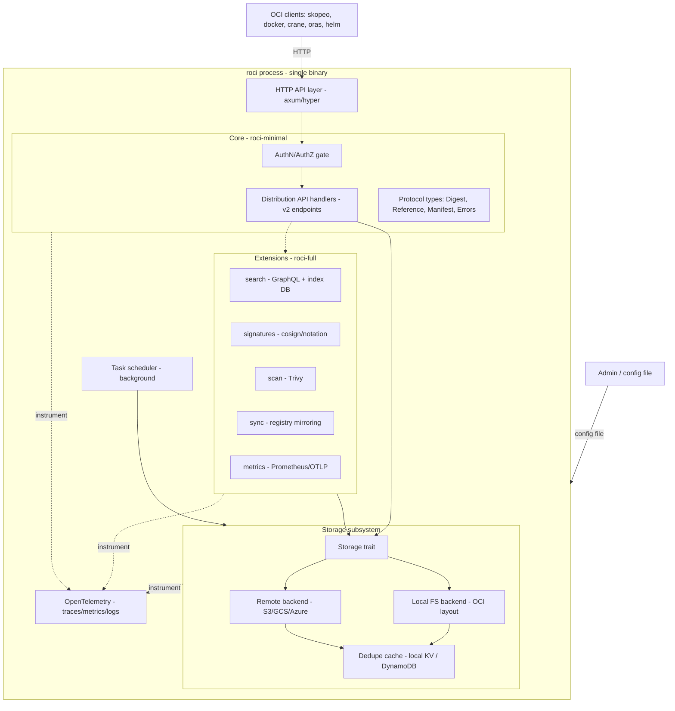

# roci — Architecture Design

Design document for **roci**, a Rust OCI Distribution registry. This document defines the internal architecture: component decomposition, data flow, the storage subsystem, and the extension model.

## Design lineage

roci's architecture is a deliberate reverse-engineering and re-implementation of [zot](https://zotregistry.dev)'s proven design, adapted to Rust and to roci's footprint/performance goals. Design sources (zot docs, v2.1.21):

- [zot — Architecture](https://zotregistry.dev/v2.1.21/general/architecture) — overall component model, minimal-vs-full split, background tasks, config sectioning.
- [zot — Storage Planning](https://zotregistry.dev/v2.1.21/articles/storage/) — storage model, dedupe, inline GC, scrub, local/remote backends, subpaths.
- [zot — Security Posture](https://zotregistry.dev/v2.1.21/articles/security-posture/) — informs [`SECURITY.md`](SECURITY.md); referenced there.
- [zot — Scale-out clustering](https://zotregistry.dev/v2.1.21/articles/scaleout/) — horizontal scale-out model (shard-per-repo, request proxying, compute-only vs. compute+storage).

Spec sources (local): [`spec/distribution-spec/spec.md`](spec/distribution-spec/spec.md), [`spec/image-spec/spec.md`](spec/image-spec/spec.md), [`spec/image-spec/image-layout.md`](spec/image-spec/image-layout.md), [`spec/docker-registry-api-v2.md`](spec/docker-registry-api-v2.md).

**Evidence basis.** The concrete engineering choices below (index engine, existence filter, GC discipline, sharding hash, lazy-pull stance) are grounded in the systems literature and production evidence collected in [`RESEARCH.md`](RESEARCH.md); citations use its source keys, e.g. (RESEARCH: Venti), (RESEARCH: CHBL).

Where roci diverges from zot, it is called out explicitly as **[roci divergence]**.

## Design goals (adopted from zot)

1. **OCI-first.** HTTP APIs strictly conform to the OCI Distribution Spec. On-disk layout is strictly OCI Image Layout. No vendor-specific protocols (no Docker schema1, no proprietary APIs). Consequence: any OCI image layout directory can be served directly, and any dist-spec-compliant client interoperates.
2. **Single binary.** All features in one static binary; behavior governed by one config file. Deployable on bare-metal, cloud, Kubernetes, and embedded/IoT.
3. **Enable only what you need.** Hard separation between the OCI-compliant core and add-on **extensions**, selectable at build-time (cargo features) and run-time (config). Minimizes dependency surface and binary size.
4. **[roci divergence] Footprint & speed as first-class invariants.** Streaming I/O end-to-end, zero-copy blob serving, bounded memory, fast cold start. Rust's no-GC memory model and `tracing`/OpenTelemetry instrumentation make footprint a measured, enforced property (see [`PLAN.md`](PLAN.md) cross-cutting benchmarks).

## Build flavors

Mirrors zot's `minimal` / `full` split, implemented with cargo features:

```
roci-full = roci-minimal + extensions
```

- **`roci-minimal`** — core OCI-compliant registry only (Distribution Spec). Smallest attack surface and binary. The baseline release.
- **`roci-full`** — minimal + all extensions (search, signatures, scanning, sync, metrics UI, …).
- **Custom** — any subset, e.g. `cargo build --features search` yields minimal + search only. The build system exposes each extension as an independent feature so operators tune the minimal↔full spectrum.

Extensions map to the OCI [distribution-spec extensions](https://github.com/opencontainers/distribution-spec/tree/main/extensions) model — features not in the Distribution Spec but permitted as extensions.

## Component model



### Layers

- **HTTP API layer.** Async server (axum/hyper). Terminates TLS, parses/validates requests, applies read/write timeouts and rate limits, routes to handlers. Every request is an OpenTelemetry span.
- **Core (`roci-minimal`).** Distribution API handlers (all `end-1`..`end-13` endpoints), protocol types (`Digest`, `RepositoryName`, `Reference`, manifest models, the 14-code error enum), and the AuthN/AuthZ gate. **The core has zero dependency on any extension.** This is the seam that makes minimal builds real.
- **AuthN/AuthZ gate.** Enforced *before* any storage access — mirrors zot: "controls are enforced before access is allowed into the storage layer." Detailed in [`SECURITY.md`](SECURITY.md).
- **Extensions (`roci-full`).** Each is an independent crate behind a cargo feature, consuming stable core + storage traits. An extension can never be on the critical path of core conformance; disabling all extensions must leave a fully conformant registry.
- **Storage subsystem.** A `Storage` trait with pluggable backends (local FS, remote object storage) and a dedupe cache. Detailed below.
- **Task scheduler.** Runs periodic background work — GC, sync mirroring, scrub, vuln-DB refresh — without degrading or interrupting foreground HTTP request handling (zot design). Bounded concurrency; foreground requests take priority.
- **OpenTelemetry.** Cross-cutting; every layer instruments spans + metric instruments into one provider (see [`PLAN.md`](PLAN.md)). **[refined from RESEARCH]** kept near-free by design: **low default trace sampling** (Dapper's lesson — aggressive sampling makes tracing overhead negligible while retaining signal) and **bounded metric label cardinality** (no per-digest/per-repo labels on high-frequency instruments — cardinality is the real footprint trap). Target < ~2% overhead at default sampling, backed by tracing-overhead studies (RESEARCH: Dapper, Canopy, TracingOH, OTelCard).

### External interaction (from zot)

Two interaction types:

1. **Client data / meta-data queries** — all over HTTP. Core data-path (pull/push/discovery/management) governed strictly by the Distribution Spec. Meta-data queries depend on the `search` extension:
   - **`search` enabled** → GraphQL over a maintained index. **[refined from RESEARCH]** the index uses the same embedded B-tree KV as the core metadata (not an LSM/RocksDB, not an external DB) — read-heavy query workload, footprint budget (RESEARCH: RUM); zot's own search backend is bbolt, confirming the class.
   - **`search` disabled** → basic queries answered from the core APIs. **[roci divergence]** the fallback hits the lightweight in-memory tag/referrer indexes + existence filters rather than raw directory scans where feasible (RESEARCH: DataDomain).
2. **Admin configuration** — a single config file governs the instance.

## Configuration model (from zot)

A single configuration file governs the instance, divided into sections:

- `http` — listen address/port, TLS, read/write timeouts, rate limits.
- `storage` — root directory, dedupe, gc, commit, subpaths, storage driver, cache driver (see storage section).
- `log` — level, format, OTLP export.
- `extensions` — per-extension enablement and settings (`search`, `signatures`, `scan`, `sync`, `metrics`).

**Sensitive-credential exception (from zot):** config items containing secrets (S3 keys, LDAP bind password, token signing keys) MAY be stored in separate referenced files, allowing stricter filesystem permissions and native Kubernetes Secret mounting. Only authorization config is live-reloadable while running (see [`PLAN.md`](PLAN.md) Phase 6); other changes require restart.

**[roci divergence]** config format is a roci decision (likely TOML/YAML with a documented schema and load-time validation), whereas zot uses JSON. Zero-config defaults must yield a working local registry with no file at all.

## Storage subsystem

The heart of the design. Two invariants, straight from zot's storage model:

> **On the wire → OCI Distribution Spec. On the disk → OCI Image Layout.**

Consequences:
- Any dist-spec client can read/write roci.
- Storage *is* an OCI Image Layout — inspectable and portable with standard tooling.
- roci can **host any pre-existing OCI image layout** directory as a registry, even one built elsewhere (independent build → store → transfer → serve later).
- **Content addressing earns four properties for free** (RESEARCH: Venti — hash-addressed archival storage): immutable/write-once blobs, idempotent coalescing writes (dedup by construction), integrity verifiable on every read (recompute the digest), and safe caching/mirroring (a content-addressed blob can never be stale — matters for scale-out proxying). roci uses OCI-mandated SHA-256/SHA-512, strictly stronger than Venti's SHA-1.
- **[roci divergence] "OCI Image Layout" means descriptors + CAS of *any* blob content, not tar-only layers.** Foreign media types (Nydus native RAFS blobs, eStargz/SOCI seekable layers, Helm charts, SBOMs, signatures) are storable and servable as blobs referenced by conformant manifests (RESEARCH: Nydus, SOCI; zot already serves Nydus). This is what makes roci a viable *origin* for the lazy-pull and artifact ecosystems.
- **[roci divergence]** roci implements no vendor protocol (same stance as zot: no Docker-specific protocol), but does vendor the Docker Registry V2 doc for the de-facto bearer-token *auth* flow only.

### Storage trait & backends

`Storage` is the abstraction all backends implement:

- **Local filesystem backend.** One or more root directories; content-addressable `blobs/<alg>/<hex>` store + `index.json`. Blob path is a pure function of digest → O(1) open. NFS/fuse mounts count as local.
- **Remote backend** (extension-gated by cost, not correctness). S3, GCS, Azure Blob — modeled after zot's `storageDriver`. Optional signed-URL redirect (HTTP 307) for blob pulls to offload proxy traffic.
- **Dedupe cache.** A digest→location index enabling cross-repo dedupe. Local KV for the FS backend; a remote table (DynamoDB/Redis-style) for cloud/cluster backends. Modeled after zot's `cacheDriver`.

Multiple storage paths (zot `subpaths`) route different repo prefixes to different backends/settings, presented as one registry over the HTTP API.

### Metadata index engine [refined from RESEARCH]

Derived, always-rebuildable-from-the-layout state (tag→digest, subject→referrers, blob-presence) lives in an embedded index — never an external database (single-binary invariant).

- **Engine choice: a single-file, embedded, B-tree-family KV with no background compaction threads (redb-class).** roci's index workload is **read-heavy, modest-write** (tag/referrer/existence lookups on every request; writes only on push/delete). The **RUM conjecture** (RESEARCH: RUM) says an access method optimizes at most two of read/update/memory amplification: an **LSM engine (RocksDB/sled) is the wrong fit** — it minimizes write amplification roci does not need, at the cost of read + space amplification and compaction CPU/threads that fight the footprint budget (RESEARCH: LSM, RocksDB). A B-tree favors reads and keeps the process thread-lean. **Corroboration:** zot's own metadata backend is **bbolt** (a single-file B-tree), not SQLite/RocksDB (RESEARCH: RUM discussion / zot finding).
- **Existence filter: an in-memory approximate-membership filter in front of the index for the hot "is this blob/manifest present?" path** (blob `HEAD`, push-time dedup skip, cross-repo mount, GC marking). This is the Data Domain lever — a summary filter removes ~99% of index/disk touches on the existence check (RESEARCH: DataDomain, Foundation). Use a **cuckoo filter** (supports deletion — required because GC removes blobs; RESEARCH: Cuckoo) for the mutable blob set; a **ribbon/xor filter** (~30–40% smaller than Bloom, RESEARCH: Ribbon) for static per-snapshot referrer sets. Cost: single-digit MB of RAM, squarely on-budget; a filter miss falls through to the authoritative index.
- **Rebuildability (RESEARCH: Venti — index separate from the write-once log, regenerable):** the layout/CAS is the source of truth; the index and filters are caches reconstructable by a bounded streaming walk. This is what makes zot-style `fastRestart` sound — a stamp mismatch just triggers a rebuild, never data loss.

### Inline storage optimizations (from zot)

All designed to run **online** — never require taking the registry offline:

- **Deduplication.** Single physical copy of identical content referenced by many manifests. On local FS with hard-link support, dedupe = hard links (no cache-hydrate needed). On cloud backends, dedupe uses the cache driver. On startup roci enforces the configured `dedupe` state across existing storage (dedupe all, or restore originals if disabled). **[roci divergence]** roci's CAS makes intra-path dedupe automatic (same digest → same file); the dedupe feature extends this *across* paths/repos.
- **`hydrateBlobOnRead` semantics (zot v2.1.21 default = repo-local).** A blob read for a digest present only in the global dedupe cache (different repo) returns `404` by default, preserving repository boundaries and never mutating storage on a read. Cross-repo access requires an explicit blob mount (`end-11`) or upload. roci adopts this repo-local-by-default read semantic; `hydrateBlobOnRead=true` restores the older hard-link-on-read behavior.
- **Garbage collection — online, grace-period, generation-based mark-and-sweep [refined from RESEARCH].** GC roots = tags + manifests + referrers. Because dist-spec blob/manifest lifecycles are **not transactional**, a sweep must never delete a blob that is mid-push or about to be referenced. **Evidence for why the discipline matters:** CNCF `distribution` requires the registry to be **read-only/offline** during GC precisely to avoid this race; Harbor (wrapping `distribution`) has a documented history of online-GC deleting in-flight blobs (RESEARCH: DistroGC, HarborGC). The safe designs from the CAS-GC literature are **grace-period / generational mark-sweep** over pure reference counting (RESEARCH: GC-FAST13, GC-FAST17). roci therefore: (a) never goes offline for GC; (b) collects a blob only if unreferenced **and** older than `gcDelay` (grace period, default 1h); (c) has the **upload-session manager pin staged blobs** so an in-flight push protects its content from the concurrent sweep; (d) collects untagged manifests unreferenced by any index/artifact after `gcDelay`. Tunables mirror zot: `gc`, `gcDelay`, `gcInterval`, `gcTimeWindow` (UTC off-peak; a started sweep runs to completion). This is a hard-evidence differentiator vs. `distribution`'s stop-the-world GC.
- **Scrub** (extension). Periodic/continuous re-hashing of blobs to detect and report bit-rot early.
- **Commit.** Optional immediate flush-to-disk (`commit=true`) for RAM-constrained embedded devices (e.g. Raspberry Pi), trading throughput for durability. Off by default.
- **[roci divergence] Fast restart.** zot's `fastRestart` skips the startup storage walk when a stamp matches binary+config identity. roci adopts this and pushes further: the startup walk is itself streaming and bounded so even a cold walk stays within the footprint budget.

### Referrers index

The subject→referrers reverse index (dist-spec `end-12a/b`) is maintained in the storage subsystem on every manifest put/delete, so `GET referrers` is an O(1) index read, not a repository scan. Falls back to the referrers-tag-schema (`<alg>-<ref>`) for compatibility. (See [`PLAN.md`](PLAN.md) Phase 3.)

**[refined from RESEARCH] The referrers index is load-bearing beyond signatures — it is the lazy-pull metadata backbone.** AWS SOCI stores its file→byte-range lazy-loading index *as an OCI referrer artifact*, and Nydus "zran" attaches a tiny `.meta` sidecar the same way (RESEARCH: SOCI, Nydus). So the same O(1) reverse index that serves signatures/SBOMs also makes lazy-pull metadata discovery cheap at hyperscale. This is why referrers is treated as core infrastructure, not a signature-only feature, and why it must stay O(1) under load.

## Background task scheduler (from zot)

A single scheduler owns all periodic work: GC sweeps, sync mirroring, scrub passes, vuln-DB refresh. Design rules:

- Bounded worker pool; foreground HTTP handling is never starved.
- Tasks are cancellation-aware and restart-safe.
- Each task is a distinct OTel span tree for observability.
- GC and scrub coordinate with the write path so an in-flight push is never corrupted.

## Scaling: vertical & horizontal

roci targets **both** scaling axes. Vertical scaling is the design's default posture; horizontal scale-out is the cluster model reverse-engineered from [zot — Scale-out clustering](https://zotregistry.dev/v2.1.21/articles/scaleout/).

### Vertical scale (scale-up) — the baseline

A single roci instance must exploit a bigger box efficiently before any clustering is needed. This is where roci's footprint/performance invariants pay off:

- Async runtime over a bounded worker pool sized to available cores; no thread-per-connection.
- Streaming, zero-copy blob I/O (`sendfile`/`mmap`) → throughput scales with disk/NIC, not CPU copies; this is the pull-path lever and the primitive lazy-pull clients (eStargz/SOCI) actually exercise via `Range` requests (RESEARCH: eStargz, SOCI, Slacker).
- O(1) content-addressed blob access; in-memory tag/referrer B-tree indexes fronted by an approximate-membership filter (§Metadata index engine) so existence checks stay off disk → query latency flat under load (RESEARCH: DataDomain).
- Bounded, back-pressured memory so a single instance uses more cores/RAM/disk linearly without falling over.
- **[roci divergence]** vertical headroom is a tracked benchmark (throughput, RSS, cold start) so scale-up efficiency never silently regresses (see [`PLAN.md`](PLAN.md)).

### Horizontal scale (scale-out) — cluster model

For a large image corpus and/or high request rate, a **cluster** of roci instances shares the workload. Model from zot:

- **Shard per repository.** Each repo is owned by exactly one instance, which alone serves and writes that repo — preventing concurrent-writer corruption without distributed locking.
- **Shard-mapping function [refined from RESEARCH].** The receiving instance maps the repo path to its owning instance. zot uses a virtual-node **hash ring**; roci **[roci divergence]** defaults to **rendezvous / HRW hashing** for the small, static `members` list — for a handful of members HRW is simpler (no ring/vnode tuning), stateless, gives naturally minimal disruption on membership change, and is more locality-stable (RESEARCH: HRW, Karger97, Dynamo). A Maglev-style lookup table (RESEARCH: Maglev) is reserved for large dynamic membership (not in the current plan).
- **Bounded-load overload protection [refined from RESEARCH].** Plain consistent/rendezvous hashing balances no better than random — expected max load Θ(log n / log log n), so a few hot repos can overload one owner. roci layers **Consistent Hashing with Bounded Loads** (cap = ⌈c·m/n⌉, `c = 1+ε`, O(1/ε²) extra moves; deployed in Google LB/HAProxy/Envoy — RESEARCH: CHBL) — **but applied to read/proxy load only.** Writes stay pinned to the deterministic owner (single-writer invariant preserved); an overflowing *read* proxies to a replica/cache and never mutates. `ε` is configurable: small (locality-favoring) default for the storage-local topology, looser for the shared-S3 compute-only topology where locality matters less.
- **Proxy to owner.** If the owner is another instance, the receiver forwards the request and proxies the response back to the client; if the receiver is the owner, it handles locally. Any instance is a valid entry point. Production evidence that proxy-forwarding overhead is acceptable at hyperscale: Kraken proxies at ≥8k-host scale while sustaining >50% line rate (RESEARCH: Kraken).
- **Keyed hash is a security requirement, not just balance.** The shard key is an attacker-influenced **repo path**, so the hash MUST be **keyed (SipHash with a per-cluster `hashKey`)** to resist hash-flooding DoS that would collide many repos onto one instance (RESEARCH: SipHash). Never an unkeyed hash. (Tracked as a security invariant in [`SECURITY.md`](SECURITY.md).)
- **Cluster config** (`cluster` section): ordered `members` list (identical ordering on every instance, each owns one address), a shared `hashKey`, and mutual-TLS between peers for authenticated intra-cluster traffic.

Two supported topologies (from zot):

1. **Compute-only scale-out.** All instances share one S3-compatible backend and one shared cache (DynamoDB/Redis-style) — `remoteCache: true`, no per-instance local cache, per-instance `dedupe` off (shared-cache dedupe instead). Scales *compute* independently of storage; storage scales via the object store itself.
2. **Compute + storage scale-out.** Cache and storage are local to each instance (each owns its shards' storage). Scales *both* compute and storage horizontally. (UI unsupported in this mode, per zot.)

Shared session state for any UI/CLI across instances uses an external Redis-compatible session store; a sticky-session load balancer (e.g. HAProxy) is the fallback.

**[roci divergence]** the cluster router, hash ring, and peer proxy live behind a `cluster` cargo feature so `roci-minimal` single-node stays dependency-lean; clustering is opt-in.

### Scale-out vs. high availability

Explicitly (from zot): scale-out is **not** HA. Each repo has a single owning instance, so an instance or its storage going offline **impacts availability** of that shard — sharing load, not providing fault tolerance. HA (redundancy so no service impact on instance/storage loss) is a separate concern layered on top (e.g. replicated/redundant object storage + multiple entry points), out of scope for the base cluster model.

### Hyperscale distribution: be a good origin, integrate external P2P [from RESEARCH]

Beyond the cluster's own capacity, the hyperscale image-distribution path is **P2P fabrics (Uber Kraken, CNCF Dragonfly) sitting *in front of* a standard registry with pluggable object-storage backends** (RESEARCH: Kraken, Dragonfly — Dragonfly reports up to 90% origin-bandwidth savings, tens of millions of launches/day). Decision: **roci does not implement in-registry P2P.** It is a different failure domain and would break the minimal-deps invariant. Instead, roci's growth path is *roci-as-origin* in the compute-only topology (S3 backend) fronted by an external Dragonfly/Kraken fabric. roci's obligation is only to be an excellent origin: fast zero-copy `Range` reads, digest-stable metadata, O(1) referrers, pluggable backends — all already in the core. Likewise, **lazy pulling** (eStargz/SOCI/Nydus) is a client-side property that needs nothing new from roci beyond `Range` + referrers (RESEARCH: Slacker, eStargz, SOCI, Nydus); its ROI is bounded to low-access-density workloads (crossover ~80%; RESEARCH: SOCI, LazyPod), which roci's docs/benchmarks must state honestly.

## Data flow examples

**Pull** (`GET /v2/<name>/manifests/<ref>` → blobs): AuthN/AuthZ gate → resolve tag/digest via B-tree index → stream manifest → client fetches referenced blobs by digest → O(1) CAS open → zero-copy `sendfile`/`mmap` stream (Range-capable, the lazy-pull access pattern).

**Push** (blobs then manifest): AuthN/AuthZ gate → existence check via cuckoo filter (skip re-upload on hit) → upload session (`end-4a`/`5`/`6`) streams to staging with hash-on-write, **staged blob pinned against concurrent GC** → digest verify → atomic rename into CAS (dedupe applies) → manifest `PUT` validates referenced-blob existence, updates tag + referrers index.

**Search** (extension): GraphQL query → served from the maintained index DB, never a storage walk.

## Module / crate layout

```
roci-core        # HTTP API, protocol types, dist-spec handlers, authn/authz gate
roci-storage     # Storage trait, local FS/CAS backend, embedded B-tree index (redb-class), cuckoo/ribbon existence filters, dedupe cache, grace-period GC/scrub engines
roci-storage-s3  # Remote object-storage backend (feature-gated)
roci-config      # Config schema, validation, live authz reload
roci-telemetry   # OpenTelemetry setup, span/metric helpers
roci-ext-search  # GraphQL search + index (feature)
roci-ext-sig     # cosign/notation (feature)
roci-ext-scan    # Trivy integration (feature)
roci-ext-sync    # registry mirroring (feature)
roci-cluster     # scale-out: HRW shard mapping + CHBL bounded-load, keyed SipHash, peer proxy (feature)
roci-cli         # single binary; assembles enabled features
```

The crate boundaries *are* the "enable only what you need" seam: `roci-minimal` = `roci-core` + `roci-storage` + `roci-config` + `roci-telemetry` + `roci-cli`; extensions are additive.

## Architectural invariants (must never regress)

1. Core builds and passes all four conformance categories with **every** extension disabled.
2. No extension crate appears in `roci-minimal`'s dependency graph.
3. AuthN/AuthZ is evaluated before any storage-trait call.
4. No code path buffers a full blob in memory; blob I/O is streamed.
5. Background tasks never corrupt or block foreground request handling.
6. On-disk state is always a valid OCI Image Layout (descriptors + CAS of any blob content; foreign media types allowed).
7. In a cluster, each repository has exactly one owning instance; no repo is written by two instances concurrently.
8. Every blob write is digest-verified (hash-on-write); every read is content-addressed. The metadata index and existence filters are caches derived from — and rebuildable from — the layout, never the source of truth.
9. GC is online and conservative: a blob is collected only if unreferenced AND past its grace period AND not pinned by an in-flight upload; the registry never goes offline/read-only for GC.
10. The cluster shard-mapping hash is keyed (per-cluster secret); bounded-load spill applies to read/proxy load only, never to writes.
11. roci contains no in-registry P2P transfer; hyperscale distribution is delegated to an external fabric with roci as origin.
